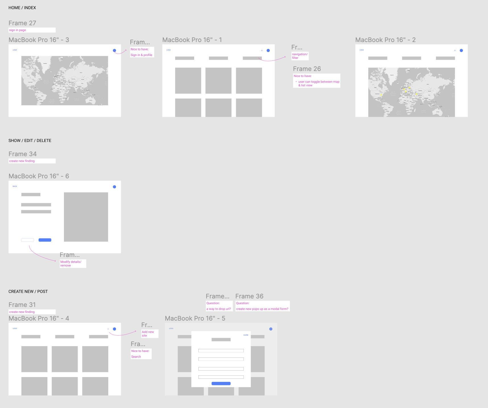

## Architecture Index

# Full Stack App

An app to keep track of architecture findings and places you have visited 

##### App Link: 

https://hidden-eyrie-63483.herokuapp.com/architecture

#### Tech: 

Node.js
Express.js
Mongodb
Mongoose 

Adhered to the MVC file structure: Models, Views and Controllers 

7 RESTful routes and full CRUD

### Stretch goals: 
1. Partials
2. Portfolio-quality styling
3. CSS Grid

### Unsolved problems:

1. User authentication
2. Creating a new marker when making a new item
3. Responsiveness
4. Image drop/upload feature
5. Visit counter displaying number of sites visited on the home screen
6. Favicon to display on all pages

### Next steps: 

1. Add a way to filter/sort
2. Add search
3. Add info page to show image sources etc.
4. Footer

### Resources: 
1. W3 Schools
2. CSS Tricks
3. Mapbox
4. Router class notes + Medium for this user authentication turtorial - https://betterprogramming.pub/build-an-authentication-api-with-node-express-and-mongodb-112b448c21f2 

### Imprint: 

All images are from Wikipedia

### Appendix: 

User story + target audience:

**Charolotte, fascinated with architecture...**

**She needs a way to compile and access all of her unique findings.**

######Targeted audience:
sightseers
preservationists
architects
homeowners
cultural institutions

Wireframes: 

